# AI Research Assistant - DBMS Sequence Diagram (Corrected)

```mermaid
sequenceDiagram
    participant Client as Frontend Client
    participant API as FastAPI Backend
    participant ChatService as Chat Service
    participant Redis as Redis Cache
    participant AIService as AI Service
    participant UserMgr as User Manager
    participant SessionMgr as Session Manager
    participant DB as PostgreSQL Database
    participant SyncService as Redis-Postgres Sync

    Note over Client, SyncService: AI Research Assistant - Database Management System

    %% User Authentication & Registration Flow
    rect rgb(240, 248, 255)
    Note over Client, DB: User Management Flow
    Client->>API: POST /api/v1/users (register)
    API->>UserMgr: create_user(email, name)
    UserMgr->>DB: INSERT INTO users
    DB-->>UserMgr: user_id, created_at
    UserMgr-->>API: User object
    API-->>Client: UserSchema response
    end

    %% Chat Session Initialization
    rect rgb(248, 255, 248)
    Note over Client, Redis: Chat Session Creation
    Client->>API: Create new chat session
    API->>ChatService: create_session()
    ChatService->>ChatService: Generate UUID
    ChatService->>Redis: store_session(session_data)
    Redis->>Redis: SET chat:session:{uuid} with TTL
    Redis-->>ChatService: Session stored
    ChatService-->>API: session_id
    API-->>Client: Session ready for chat
    end

    %% Real-time Chat Message Flow
    rect rgb(255, 248, 240)
    Note over Client, AIService: Chat Messaging Flow
    Client->>API: POST /chat/send (user message)
    API->>ChatService: send_message(session_id, content)
    
    %% Store user message in Redis
    ChatService->>Redis: add_message_to_session()
    Redis->>Redis: Update session messages array
    Redis->>Redis: PUBLISH session_updated event
    Redis-->>ChatService: User message stored
    
    %% Generate AI response
    ChatService->>AIService: generate_response(content, history)
    AIService->>AIService: Process with context & ML model
    AIService-->>ChatService: AI response content
    
    %% Store AI response in Redis
    ChatService->>Redis: add_message_to_session()
    Redis->>Redis: Append AI message to session
    Redis->>Redis: PUBLISH session_updated event
    Redis-->>ChatService: AI message stored
    
    ChatService-->>API: ChatResponse (user + AI)
    API-->>Client: Complete conversation turn
    end

    %% Background Data Synchronization
    rect rgb(255, 240, 255)
    Note over Redis, SyncService: Background Sync Process
    Redis->>SyncService: session_updated event
    SyncService->>Redis: get_session(session_id)
    Redis-->>SyncService: Complete session data
    
    loop For each new message
        SyncService->>DB: INSERT INTO messages
        DB-->>SyncService: message_id
    end
    
    SyncService->>DB: UPDATE sessions SET updated_at
    DB-->>SyncService: Session updated
    end



    %% Chat History Retrieval
    rect rgb(248, 248, 255)
    Note over Client, DB: History Retrieval Flow
    Client->>API: GET /chat/history/{session_id}
    
    alt Redis Cache Hit
        API->>ChatService: get_session_history()
        ChatService->>Redis: get_session(session_id)
        Redis-->>ChatService: Cached session data
        ChatService-->>API: Message history
    else Redis Cache Miss
        API->>SessionMgr: get_session_messages()
        SessionMgr->>DB: SELECT * FROM messages WHERE session_id
        DB-->>SessionMgr: Message records
        SessionMgr-->>API: Message history
        
        %% Restore to cache for future requests
        opt Restore to Redis
            API->>ChatService: restore_to_cache()
            ChatService->>Redis: store_session()
            Redis-->>ChatService: Cached
        end
    end
    
    API-->>Client: Chat history response
    end

    %% Research Paper Management
    rect rgb(255, 255, 240)
    Note over Client, DB: Paper Search & Management
    Client->>API: GET /api/v1/papers/search?query=keyword
    
    %% Search by paper title first
    API->>DB: SELECT * FROM papers WHERE title LIKE query
    
    alt Paper found by title
        DB-->>API: Papers found by title
        API-->>Client: Papers with predefined tags
        
    else No papers found by title
        DB-->>API: No title matches
        
        %% Search by tags as fallback
        API->>DB: SELECT papers FROM paper_tags JOIN papers WHERE tag LIKE query
        
        alt Paper found by tags
            DB-->>API: Papers found by tags
            API-->>Client: Papers with matching tags
            
        else No papers found by title or tags
            DB-->>API: No matches found
            API-->>Client: No papers in database, search ArXiv?
            
            opt User requests ArXiv search
                Client->>API: POST /api/v1/papers/fetch-arxiv
                API->>API: Search ArXiv API by query
                
                alt Paper found on ArXiv
                    API->>API: Download PDF from ArXiv
                    API->>API: Auto-generate predefined tags
                    API->>DB: INSERT INTO papers
                    DB-->>API: paper_id
                    API->>DB: INSERT INTO paper_tags (predefined)
                    DB-->>API: Tags associated
                    API-->>Client: Paper fetched and available
                    
                else Paper not found on ArXiv
                    API-->>Client: Paper not available anywhere
                end
            end
        end
    end
    
    %% Add selected paper to session
    opt User selects paper to add
        Client->>API: POST /api/v1/session-papers
        API->>DB: INSERT INTO session_papers
        DB-->>API: Paper linked to session
        API-->>Client: Paper added to session
    end
    end

    %% Group Collaboration
    rect rgb(255, 248, 255)
    Note over Client, DB: Group & Collaboration Flow
    Client->>API: POST /api/v1/groups
    API->>DB: INSERT INTO groups
    DB-->>API: group_id
    
    Client->>API: POST /api/v1/group-participants
    API->>DB: INSERT INTO group_participants
    DB-->>API: Participant added
    
    API-->>Client: Collaborative group ready
    end

    %% Feedback Collection
    rect rgb(255, 240, 240)
    Note over Client, DB: Feedback Collection
    Client->>API: POST /api/v1/feedback
    API->>DB: INSERT INTO feedback
    DB-->>API: feedback_id
    API-->>Client: Feedback recorded
    end
```

## Fixes Applied:

1. **Removed all activation symbols** (`+` and `-`) that were causing the "inactive participant" error
2. **Simplified arrow syntax** to use standard Mermaid sequence diagram notation
3. **Maintained all the functional workflows** while ensuring proper syntax
4. **Kept the paper management improvements** with search and ArXiv integration
5. **Preserved the background synchronization logic** without syntax errors

The diagram should now render correctly without any participant activation errors. You can copy this corrected version to replace the problematic one in your untitled file.
